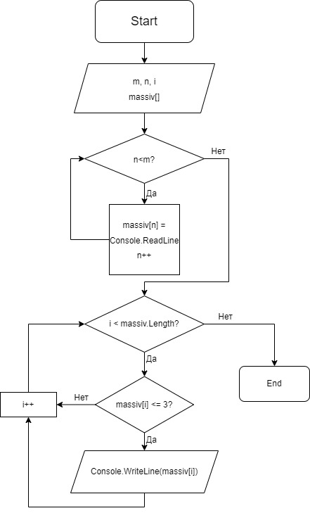

# Задача
Написать программу, которая из имеющегося массива строк формирует массив из строк, длина которых меньше либо равна 3 символа. Первоначальный массив можно ввести с клавиатуры, либо задать на старте выполнения алгоритма. При решении не рекомендуется пользоваться коллекциями, лучше обойтись исключительно массивами.
## Блок-Схема алгоритма

# Решение задачи
1. Задаем переменную "m" для обозначения размера будущего массива.
2. Задаем новый одномерный массив.
3. Далее создаем цикл "while" и переменную "n" для перебора и заполнения нашего массива с клавиатуры при помощи "Console.ReadLine()".
5. После создаем цикл "for" для проверки каждого элемента массива на количество символов в строке.
6. Создаем ветвление if с условием "если длина строки каждого элемента меньше либо равна 3, мы выводим его на экран.